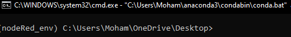
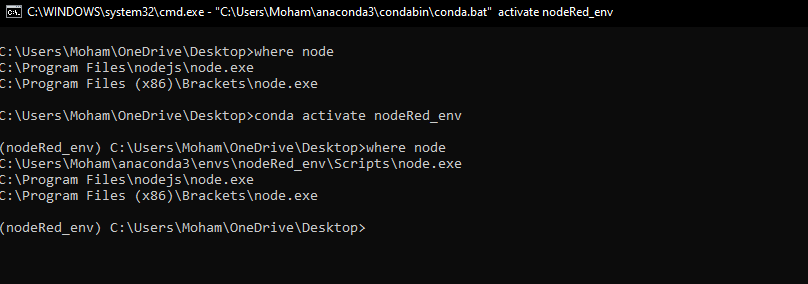
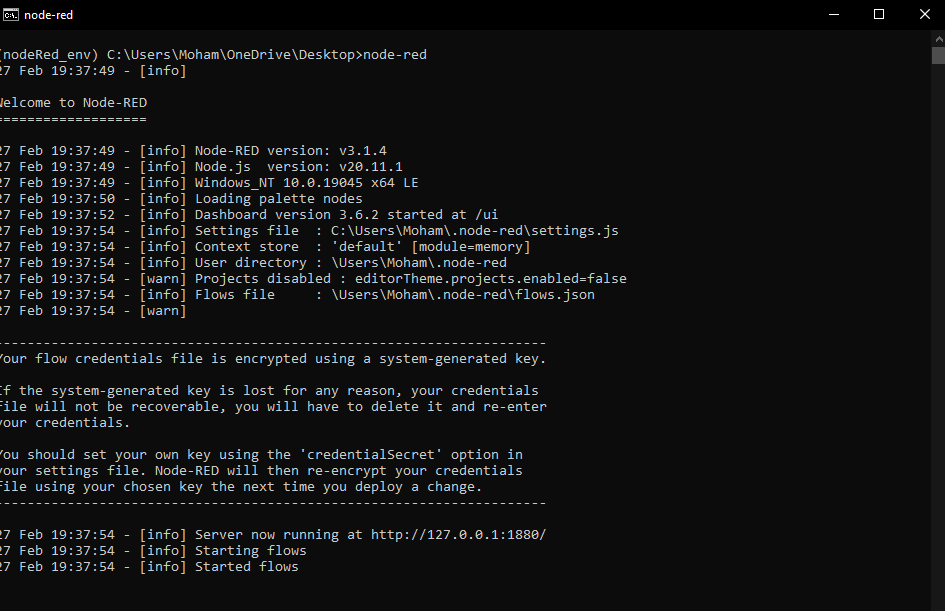
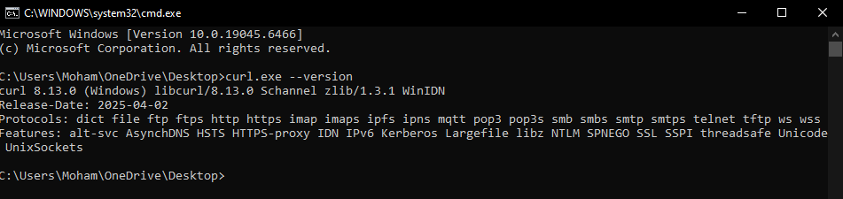

# Introduction to IoT, 2026

Cloud Computing and Node-RED

## What is Node-RED?

Node-RED is a visual programming tool developed by IBM that allows developers to connect hardware devices, APIs, and online services in a simple and intuitive way. It provides a browser-based flow editor where users can drag and drop pre-built nodes to create workflows, making it easy to wire together data streams without writing complex code. Built on Node.js, Node-RED is lightweight and can run on various platforms from local computers to low-power devices like Raspberry Pi. With its rich library of over 225,000 modules, support for protocols like MQTT and HTTP, and built-in dashboard for visualization, Node-RED has become one of the most popular tools for IoT development, enabling both beginners and experts to quickly prototype and deploy IoT solutions.

------------------------------------------------------------------------

# Requirements
-   **Install Curl** 
-   **Install Conda envirement** or Python envirement manager.
-   **Node.js version:** v20.11.1
-   **NPM version:** 10.2.4
-   **Node-RED version:** v3.1.5


For installation you can follow instruction in node-red website: https://nodered.org/docs/. You can also follow the steps below, given that you run command line as admin.


------------------------------------------------------------------------
if you have conda envirement or pytho + installed virtualenv, move to step 3.

## [Optional] 1. Install Curl
- check if curl is installed    
    ```
    curl --version
    ```
    you can use curl command from github bash.

- if curl is uninstalled, go download version 8.12.1_3 (or similiar):
    ```
    https://curl.se/download.html

    ```

    - for windows:
        ```
        https://curl.se/windows/dl-8.12.1_3/curl-8.12.1_3-win64-mingw.zip
        ```

        - unpack it -> go inside bin/ folder -> you find curl.exe, here you can open ccommand line and  use curl command or use absolute path to curl folder, such as:
                    C:\Users\USER\Downloads\curl-8.12.1_3-win64-mingw\curl-8.12.1_3-win64-mingw\bin
	- reopen the terminal
------------------------------------------------------------------------

## [Optional] 2. Install Conda, python envirement or any similiar virtual envirement.
Install either conda or usse python env.

1- conda

- check if conda is installed (use may need to use the path to curl)

    ```
    conda --version
    ```

- if  is uninstalled:
    - check https://www.anaconda.com/docs/getting-started/miniconda/install
    - for windows: curl https://repo.anaconda.com/miniconda/Miniconda3-latest-Windows-x86_64.exe --output .\Miniconda3-latest-Windows-x86_64.exe
        - run *.exe file
        
- check installation: 

    ```
    conda --version    
    ```

2- pythonenv

- If python is uninstalled, download and Install python 3.10 (or similar): https://www.python.org/downloads/
- Install virtualenv (if needed)
    ```
    pip install virtualenv
    ```

 ------------------------------------------------------------------------

## 3.  creat envirement (conda, virtualenv, ...)
1 - Conda
```
conda create --name nodeRed_env python=3.10.0 -y
conda activate nodeRed_env
```


 
 2- create python envirement

```
mkdir Lab4 &&  cd Lab4
python -m venv nodeRed_env
```

 Activate the environment
**Windows:**
```
nodeRed_env\Scripts\activate
```

If scripts cannot be executed in PowerShell [windows]:
```
Set-ExecutionPolicy RemoteSigned
```
Type `A` to confirm.


**Linux:**
```
source nodeRed_env/bin/activate
```

 ------------------------------------------------------------------------
 ------------------------------------------------------------------------
## 4. Install nodeenv (Node.js virtual environment): the envirement should be activated.
nodeenv is a Python tool that creates an isolated Node.js environment, similar to how venv isolates Python.

```
pip install nodeenv==1.9.1
```
    
## 4. Install Node.js version 20.11.1 inside the currently active Python virtual environment:

```
nodeenv -p --node=20.11.1
```

------------------------------------------------------------------------

### 5. Verify Node.js and NPM versions
    node --version &  npm --version

check where node is installed.
```
where node
```



------------------------------------------------------------------------

### 6. Install Node-RED

    npm install -g --unsafe-perm node-red@3.1.5

### 7. Install Required Node-RED Packages (later, we can install the packages from Node-Red)

    npm install node-red-dashboard
    npm install node-red-contrib-calc
    npm install node-red-contrib-telegrambot --save

### 8. Install Python Libraries
```
pip install requests
pip install numpy
```

### 9. Run Node-RED

```
node-red
```
- You should see:

Welcome to Node-RED. The server runs locally at: http://127.0.0.1:1880


------------------------------------------------------------------------
------------------------------------------------------------------------
------------------------------------------------------------------------
------------------------------------------------------------------------


https://docs.conda.io/en/latest/miniconda.html
Python 3.x version


    conda --version
    conda 24.x.x


## Windows Installation (PowerShell as Administrator)

### 1. Install virtualenv (if needed)

    pip install virtualenv

### 2. Create a virtual environment

    mkdir Lab4 &&  cd Lab4
    python -m venv nodeRed_env

### 3. Activate the environment

**Windows:**

    nodeRed_env\Scripts\activate

**Linux:**

    source nodeRed_env/bin/activate

If scripts cannot be executed in PowerShell:

    Set-ExecutionPolicy RemoteSigned

Type `A` to confirm.

------------------------------------------------------------------------

### 4. Install nodeenv

    pip install nodeenv==1.9.1
    nodeenv -p

### 5. Verify Node.js and NPM versions

    node --version &  npm --version

Expected: - Node.js → v20.11.1 - NPM → 10.2.4

------------------------------------------------------------------------

### 6. Install Node-RED

    npm install -g --unsafe-perm node-red@3.1.5

### 7. Install Required Node-RED Packages

    npm install node-red-dashboard
    npm install node-red-contrib-calc
    npm install node-red-contrib-telegrambot --save

### 8. Install Python Libraries

    pip install requests
    pip install numpy

------------------------------------------------------------------------

### 9. Run Node-RED

    node-red

You should see:

    Welcome to Node-RED

The server runs locally at:

    http://127.0.0.1:1880

------------------------------------------------------------------------

# Install Curl

**Tested version:** 8.9.1 (Windows)

Download from: https://curl.se/download.html

OR

use direct download: https://curl.se/windows/dl-8.12.1_3/curl-8.12.1_3-win64-mingw.zip

unpack it -> go inside bin/ folder -> you find curl.exe, here you can open ccommand line.

## Check if Curl is installed

**Windows:**

    curl --version
    OR
    curl -V

**Linux / Mac:**

    sudo apt update
    sudo apt install curl

OUTPUT:



## Test Curl Installation

    curl -iX GET "https://www.example.com" -H "accept: application/json"

------------------------------------------------------------------------

# Reference

Node environment documentation:\
https://nodered.org/

https://nbdime.readthedocs.io/en/latest/nodevenv.html


Install curl


curl https://repo.anaconda.com/miniconda/Miniconda3-latest-Windows-x86_64.exe --output .\Miniconda3-latest-Windows-x86_64.exe


install python 3.14.3: https://www.python.org/downloads/release/pymanager-260/


Do not forget to vote in the Telegram poll to confirm that everything is
installed correctly.
